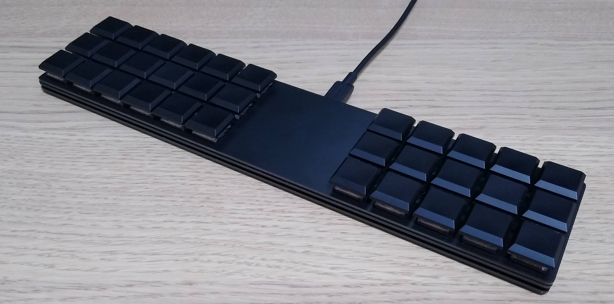
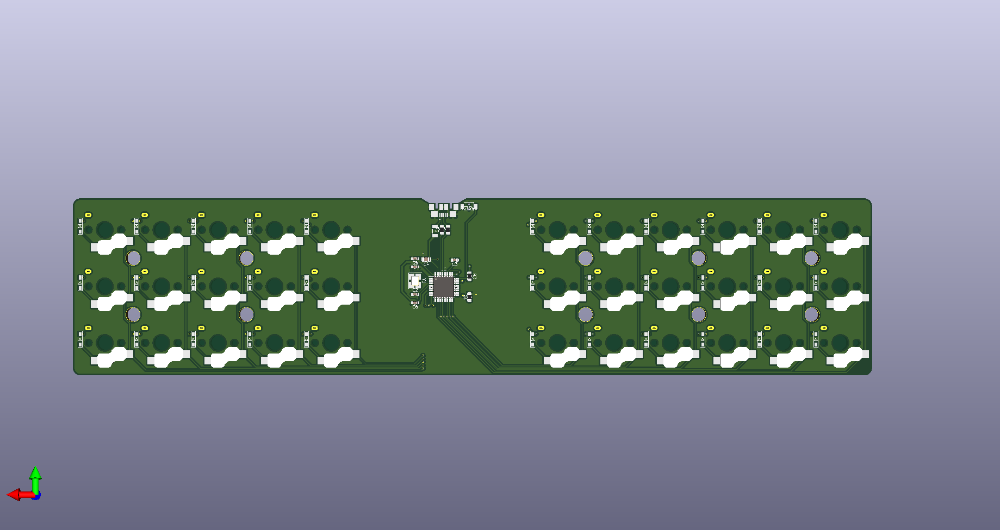

# barracuda
barracuda (Thin Plate Keyboard)

**PCB (kicad 3D viewer)**

# Concept

* Ortholinear
  * 3 rows \* 6 columns on left, 5 columns on right, total 33 keys
* Key switch hot-swap capable
  * Supports Kailh PCB socket for Choc low profile switches
  * (Mounting hole for Choc V2 switches are also ready on PCB, but I have not tried myself.)
* Very thin design
  * Only supports SMT diodes (1N4148W)
  * Not using ProMicro but using ATmega32U2 mounted directly on PCB.
* Dimension
  * Length: 271.4 mm
  * Width: 59.7 mm
  * Height (PCB bottom to key top): About 15 mm
    * NOTE: with Kailh Choc (V1) switch and Kailh key caps.

# BOM list

| Name                | Parts id          | Number |
| ------------------- | ----------------- | ------ |
| MCU                 | ATmega32U2 (TQFP) | 1      |
| Socket (ChocV1)     | CPG135001S30      | 33     |
| Diode               | 1N4148W           | 33     |
| Reset Switch        | TVAF06-A020B-R    | 1      |
| Spacer (M2 4mm)     | ARB-2004E         | 10     |
| Thread (M2 3mm)     | -                 | 20     |
| USB micro connector | -                 | 1      |
| Poly fuse           | -                 | 1      |
| Crystal (16MHz)     | FA238             | 1      |
| Resistor (22ohm)    | 2012size          | 2      |
| Resistor (10kohm)   | 2012size          | 2      |
| Capacitor (22pF)    | 1608size          | 2      |
| Capacitor (0.1uF)   | 1608size          | 2      |
| Capacitor (1uF)     | 1608size          | 1      |
| Capacitor (10uF)    | 2012size          | 1      |

# Firmware

QMK support is available in my forked [qmk_firmware](https://github.com/knaruo/qmk_firmware) (barracuda/default)

# Build Guide