# ビルドガイド (日本語)

## 部品表

| 部品名                  | 型番              | 数量 | 備考                                   |
| ----------------------- | ----------------- | ---- | -------------------------------------- |
| PCB                     | barracuda PCB     | 1枚  |                                        |
| トッププレート          | barracuda top     | 1枚  | 基板と同じ素材 (FR4 1.6mm)             |
| ボトムプレート          | barracuda bottom  | 1枚  | 基板と同じ素材 (FR4 1.6mm)             |
| MCU                     | ATmega32U2 (TQFP) | 1個  | ファームウェア未書き込み状態           |
| ダイオード              | 1N4148W           | 33個 | 表面実装型のダイオード                 |
| リセットスイッチ        | TVAF06-A020B-R    | 1個  | ファームウェア書き込みに必要           |
| USBマイクロ コネクタ    | ...               | 1個  |                                        |
| フューズ                | ...               | 1個  |                                        |
| 水晶振動子 (16MHz)      | FA238             | 1個  |                                        |
| チップ抵抗 (22 Ohm)     | サイズ 2012       | 2個  | USB通信ライン用                        |
| チップ抵抗 (10 kOhm)    | サイズ 2012       | 2個  | プルアップ・プルダウン用               |
| コンデンサ (22pF)       | サイズ 1608       | 2個  | 水晶振動子用                           |
| コンデンサ (0.1uF)      | サイズ 1608       | 2個  |                                        |
| コンデンサ (1uF)        | サイズ 1608       | 1個  |                                        |
| コンデンサ (10uF)       | サイズ 2012       | 1個  |                                        |
| スペーサー (高さ4mm M2) | ARB-2004E         | 10個 | ボトムプレート・トッププレート間の保持 |
| 低頭ネジ (M2 長さ3mm)   | ...               | 20個 |                                        |


## 各自用意していただくもの

| 部品名                 | 型番                            | 数量      | 備考                                                         |
| ---------------------- | ------------------------------- | --------- | ------------------------------------------------------------ |
| キースイッチ           | Kailh Choc V1                   | 33個      |                                                              |
| キーキャップ           | Kailh Choc V1互換のもの         | 33個      |                                                              |
| キースイッチ用ソケット | CPG135001S30                    | 33個      | Kailh Choc用のソケット                                       |
| USBケーブル            | タイプAオス - マイクロBケーブル | 1本       |                                                              |
| ゴム足                 | -                               | 4個(以上) | 打鍵時のガタツキを防ぐため用意していただくことをお勧めします |


## 工具

非常に細かい表面実装部品のはんだ付けが必要になるため、はんだ付け関連の工具は充実させておくことを強くお勧めします。

| 工具                 | 説明                                                                                                                 |
| -------------------- | -------------------------------------------------------------------------------------------------------------------- |
| はんだごて           | 温度調整機能付きが便利です。                                                                                         |
| はんだ               | 融点の低い鉛入りが扱いやすいです。                                                                                   |
| コテ先               | C型(円錐を斜めに切った形)が使いやすいです。先が細すぎても熱が伝わらないのでご注意。                                  |
| フラックス           | はんだを融け広がりやすくするものです。細かい部品のはんだ付けが易しくなります。                                       |
| フラックスクリーナー | フラックス使用後、基板をきれいにするために使います。フラックスをそのままにしておくと基板が酸化しやすくなるようです。 |
| ピンセット           | 先の細いもの。                                                                                                       |
| マスキングテープ     | 部品の位置を仮止めするのに便利です。                                                                                 |
| テスター             | 導通確認用                                                                                                           |
| 精密ドライバー       | プレート組み立てにプラスドライバーが必要です。                                                                       |


# 組み立て

## 基板の確認

MCU等のパターンがあるほうが、部品の実装面です。すべての部品はこちらの面に実装されます。

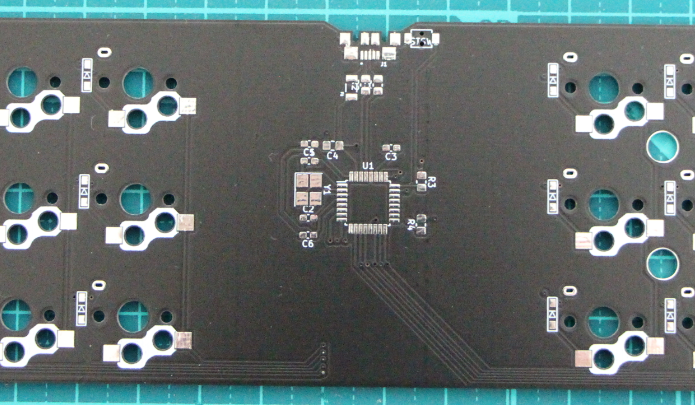

## MCU周りのはんだ付け

まず、MCUにファームウェアを書き込むための回路をはんだ付けしていきます。いきなり一番難易度が高いところからスタートです・・・。

### USBコネクタ周辺
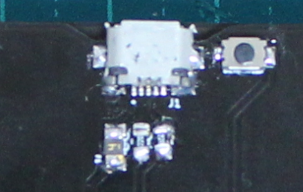
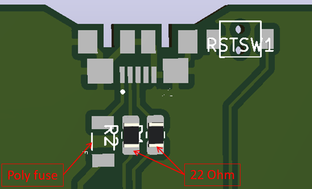

マイクロUSBコネクタを基板に載せ、5つあるピンがランドに合うようにしてマスキングテープで仮止めします。この状態でピン5つとケースグランド4点をはんだ付けします。
特にピンのはんだ付けの際はフラックスを使うと失敗しにくいです。

つづいて、コネクタ直下のヒューズ, 22 Ohm抵抗2つをはんだ付けします。

USBコネクタのとなりのリセットスイッチもMCUへのファームウェア書き込みに必要なので、このタイミングで実装します。


### MCU周辺
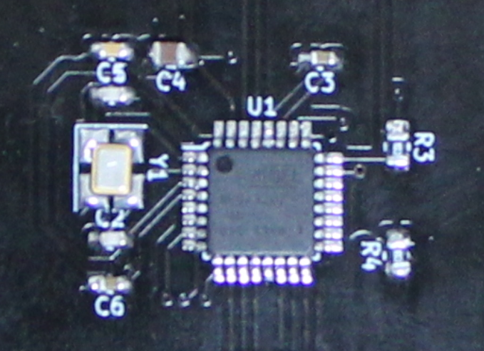

MCU (ATmega32U2)をはんだ付けします。MCUは向きに注意します。MCUの角に●があります。●が写真の向きになるように設置します。USBコネクタのときと同様フラックスをうまく使ってはんだ付けします。


MCUのとなりの水晶振動子と、22pFのコンデンサ2個をはんだづけします。水晶振動子は接点が4つあり、特に向きに注意が必要です。以下に図示するように水晶振動子の文字列を合わせてください。


コンデンサも油断するとどこかに無くしてしまうくらいの小ささなのでご注意ください。

MCU, 水晶振動子の後は、周辺のコンデンサとチップ抵抗を付けていきます。コンデンサは容量が0.1uF, 1uF, 10uFの3種類あります。コンデンサは見た目でほぼ区別がつかないので、ひとつずつ開封して実装することをお勧めします。

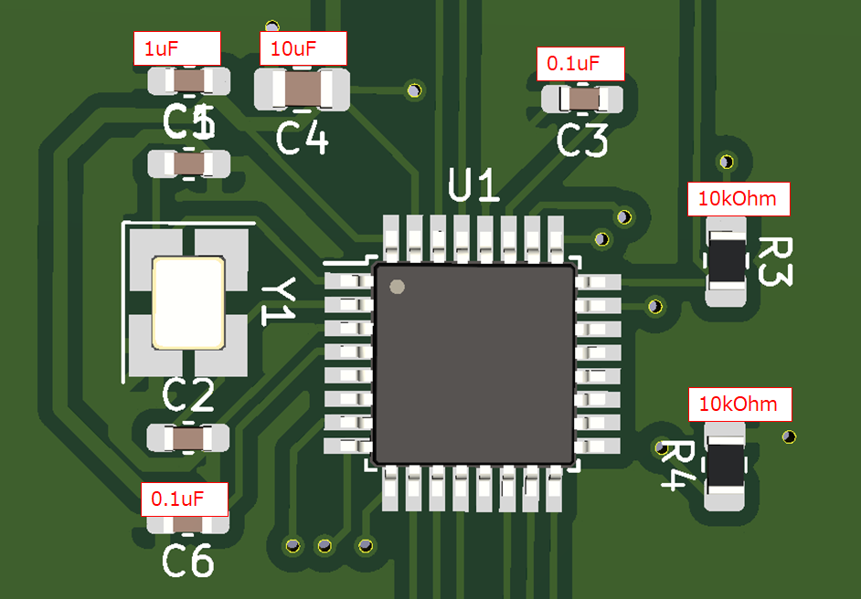


### 接続確認

ここまで完成したら、一旦PCとキーボード基板がUSB接続可能かをテストします。

PCと基板を接続する前に、念の為基板の+5VとGNDが短絡していないことを確認します。
PCを接続したときに誤ってPCが破損しないための確認です。

下の写真の+5V (ヒューズの端子)とGND(USBコネクタのケースグランド)をテスターで当たって、ショートしていないことを確認します。

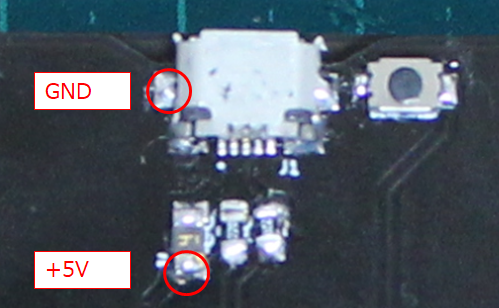

問題無ければ、PCとキーボード基板を接続します。
マイクロUSBケーブルで基板とPCを接続し、PC側のデバイスマネージャで、基板がATmega32U2として認識されれば、
MCU周りの実装はうまくいっています。
(作者の環境がWindowsのみでしたので、Mac,Linuxでの確認は実施していません)


## ダイオードの実装

ダイオードをキースイッチの個数分はんだ付けします。
ダイオードは向きがあります。基板上のダイオードのシンボルの線"-"とパーツの線の向きを合わせてはんだ付けしてください。

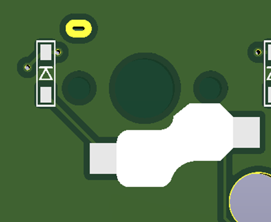

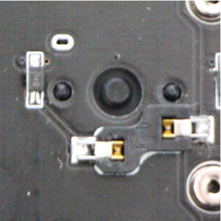


## キースイッチソケットの実装

ソケットをはんだ付けします。ソケットは基板から浮いてしまわないよう、マスキングテープで位置を仮止めした状態ではんだ付けすると良いと思います。

以上で、部品のはんだ付けは終了です。


## キースイッチ取り付け

トッププレートにキースイッチを並べます。この際、PCBにはんだづけしたソケットの穴の向きとスイッチの足の向きが合うことを確認してください。

トッププレートにすべてのキースイッチを並べたら、トッププレートとPCBをあわせてキースイッチの足をソケットに挿入します。キースイッチの足が折れ曲がってしまわないように、スイッチの足がしっかりソケットの穴にあたっていることを確認しながら慎重に作業します。

## ボトムプレートのネジ止め

PCBにスペーサ用の穴が10個空いています。4mmスペーサを穴に入れて、トッププレート側から低頭ネジでネジ止めします。

ボトムプレートを、ネジ穴がスペーサの穴に合うように固定し、ボトムプレート側からも低頭ネジでネジ止めします。

## ゴム足の貼り付け

必要であれば、ボトムプレートの四隅に滑り止めのゴム足を貼り付けます。

以上で組み立て工程は終わりです。


# ファームウェアの書き込み

## QMK Toolboxのインストール

このキーボードでは、少なくとも初回のファームウェア書き込みにはQMK Toolboxというツールを使います。

[qmk_toolbox release](https://github.com/qmk/qmk_toolbox/releases)ページから最新バージョンのQMK Toolboxインストーラを入手し、インストールします。

## デフォルトのファームウェアを入手する

[VIA/Download Firmware](https://caniusevia.com/docs/download_firmware) から、```barracuda_via.hex```をダウンロードします。


## QMK Toolboxでデフォルトファームウェアを書き込む

まず、組み立てたキーボードをPCとUSB接続します。

QMK Toolboxを立ち上げ、先程ダウンロードした```barracuda_via.hex```をファイル選択します。

また、**MCUはatmega32u2を選択します**。

Auto-Flashのチェックボックスもチェックしておきます。

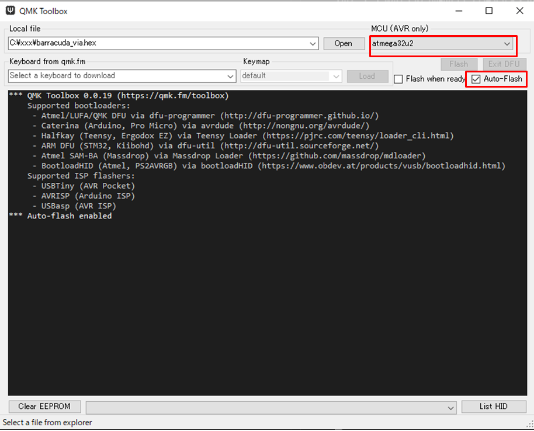

書き込みの準備ができたら、ボトムプレート側USBコネクタ脇のリセットスイッチを押します。こうすることでMCUにリセットがかかり、それをトリガーにファームウェアの書き込みがスタートします。

書き込みが完了すると、以下のように
```
0x*** bytes written into 0x7000 bytes memory (**.**%)
```
という書き込み終了メッセージが表示されるはずです。

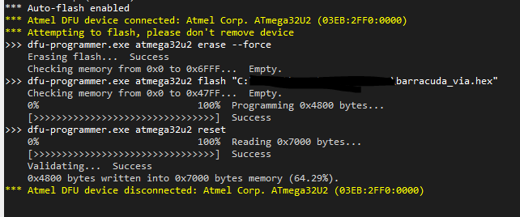


## キーマップ編集方法 1: Remap

[Remap](https://remap-keys.app/)はウェブブラウザ(Google Chrome)から直接キーマップを編集できる非常に便利なツールです。
ソースコードのコンパイルも専用ソフトのインストールも不要で、barracudaキーボードをPCに接続さえすればキーマップが編集できるという、非常に便利なツールです。

まず[remap-keys.app](https://remap-keys.app/)にアクセスし、Start Remap For Your Keyboardボタンをクリックします。


barracudaキーボードをPCに接続していれば、以下のように+KEYBOARDの選択肢が現れるのでクリックします。
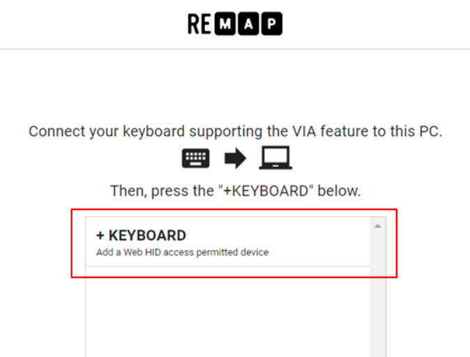

下のように各レイヤーのキーマップが表示されるので、下のキーコードの一覧からキーをドラッグし、変更したいキーの上でドロップすることでキーマップを編集できます。編集後、画面右上のflashボタンをクリックすることで変更したキーマップをキーボードに書き込んで変更を反映させることができます。
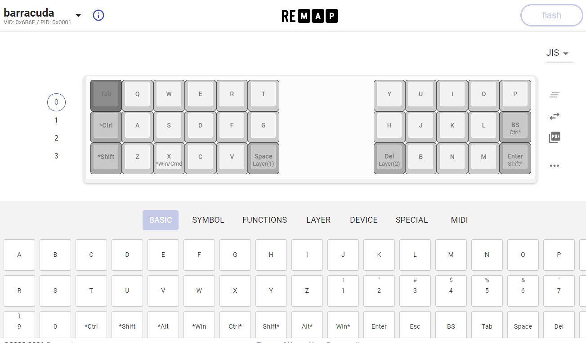


## キーマップ編集方法 2: VIA (プルリクエスト申請中)

VIAというツールの最新リリースをこちらからダウンロード・インストールします。
[VIA Releases](https://github.com/the-via/releases/releases)

VIAを起動して、キーボードを接続すると、このようにキーマップが表示されます。

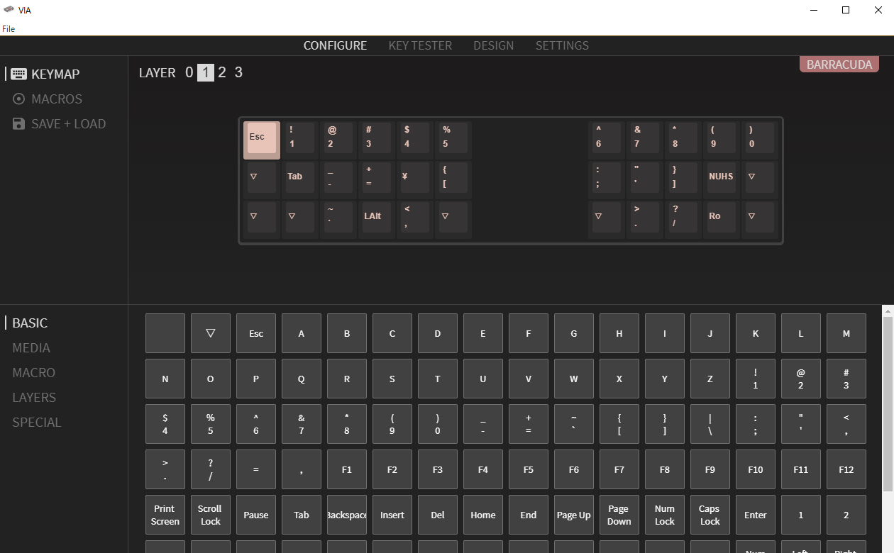

各スイッチに割り当てたいキーコードを下のマップから選択すると、その場でキーボードに反映される便利なツールです。

また、KEY TESTERタブを選ぶとキーボードの動作確認もできます。


## キーマップ編集方法 3: QMK Firmware

RemapやVIAは非常に便利な上に十分高機能ですが、QMKファームウェアで実現できる機能の一部は実装できません。
例えば, tap danceというシングルタップ、ダブルタップ、長押しでそれぞれ送るキーコードを変えるような機能は、Remap/VIAからは利用できません。

ファームウェアをフルにカスタマイズしてみたい方は、[QMK Firmware](https://github.com/qmk/qmk_firmware)のgithubレポジトリをフォークして、```keyboards/barracuda```以下のキーマップのコードで色々と試していただければと思います。
